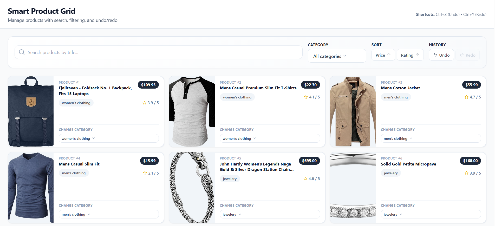

# SmartGridProduct

SmartGridProduct is a React + TypeScript web app that demonstrates a polished product grid with search, custom filters, sort controls, optimistic category edits, undo/redo history, and simulated live updates.

## Desktop Snapshot



## Highlights

- Search products by title with debounced input
- Filter products with a custom dropdown component
- Sort by price or rating in ascending or descending order
- Edit product categories with optimistic UI updates
- Undo and redo category changes with keyboard shortcuts: Ctrl+Z (Undo) • Ctrl+Y (Redo)
- Display product images from the API
- Simulate live server updates for price and rating
- Persist UI state in `localStorage`

## Tech Stack

- React 18
- TypeScript
- Vite
- Zustand
- Tailwind CSS
- Axios
- React Toastify

## Project Structure

```text
src/
├── api/
├── components/
├── features/
├── hooks/
├── store/
├── types.ts
├── App.tsx
├── index.css
└── main.tsx
```

## Getting Started

### Install dependencies

```bash
npm install
```

### Start the development server

```bash
npm run dev
```

The app usually runs at `http://localhost:5173`.

### Create a production build

```bash
npm run build
```

### Preview the production build

```bash
npm run preview
```

## Key Features

### Product cards

Cards show the product image, title, price, category, and rating. Category editing is done with a reusable custom select component instead of the browser default.

### Live updates

The app simulates backend-driven product updates so the UI can demonstrate conflict-safe state changes and live data refreshes.

### History controls

The store keeps past, present, and future state so local edits can be undone and redone.

## GitHub Codespaces

- This folder is ready to open in GitHub Codespaces.
- Run `npm install` and then `npm run dev` after the workspace opens.
- No extra environment variables are required.

## Available Scripts

- `npm run dev` - Start the local dev server
- `npm run build` - Build the app for production
- `npm run preview` - Preview the production build locally

## Notes

- Product data is fetched from Fake Store API.
- The app uses simulated live updates, so price and rating values may change while you browse.
- If you want, add a license file before publishing the repository publicly.